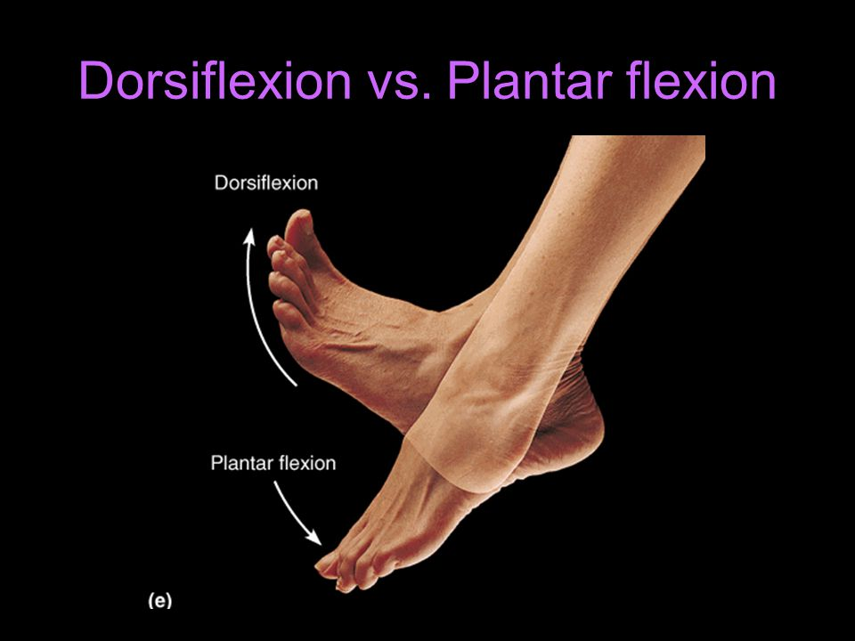
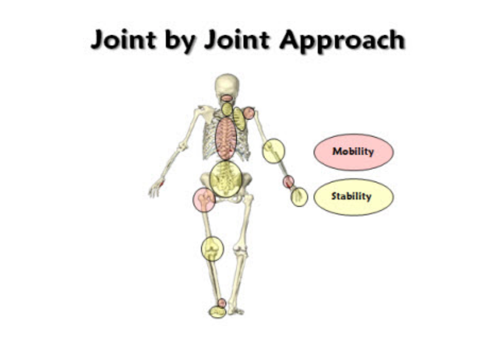

# Grant's Ankle Plan

- [Grant's Ankle Plan](#grants-ankle-plan)
  - [Goal](#goal)
  - [Exercises](#exercises)
    - [Test: Perform Knee to Wall Test](#test-perform-knee-to-wall-test)
  - [3 minute SMR with lacrosse ball](#3-minute-smr-with-lacrosse-ball)
  - [2 minute weighted ankle mobility](#2-minute-weighted-ankle-mobility)
  - [Banded Ankle Mobilization](#banded-ankle-mobilization)
  - [Three rounds of the following](#three-rounds-of-the-following)
    - [Plate Ankle Mobilizations](#plate-ankle-mobilizations)
    - [Practice Loading the Ankle](#practice-loading-the-ankle)
  - [Concepts](#concepts)
    - [Dorsiflexion vs Plantar Flexion](#dorsiflexion-vs-plantar-flexion)
    - [Talo-Crural Joint](#talo-crural-joint)
    - [Distal](#distal)
    - [Parts of the Leg (Soft Tissue)](#parts-of-the-leg-soft-tissue)
    - [Squatting: Mobility vs Stability](#squatting-mobility-vs-stability)
    - [Sagittal Plane](#sagittal-plane)
  - [Questions](#questions)
    - [What does this mean?](#what-does-this-mean)
  - [Sources](#sources)

## Goal

1. Pass the wall test
2. Achieve 40 degrees of dorsiflexion

## Exercises

### Test: Perform Knee to Wall Test

Place your foot on a tape strip that is 4 inches away from the wall.  With your foot in a neutral position, attempt to touch your knee to the wall without going into valgus or varus collapse. Do not let your heel come off the ground.

## 3 minute SMR with lacrosse ball

Use a lacrosse ball to perform SMR on the leg - 3 minutes per side. All the way up and down. See [here](#parts-of-the-leg-soft-tissue) for parts of the leg.

## 2 minute weighted ankle mobility

2 minutes each side using weight on knee ankle stretch

## Banded Ankle Mobilization

https://youtu.be/K1fY0BwT5nE

- Place band at ankle joint line, at the level between medial and lateral malleoli
- Place a considerable amount of tension through the band.
- Bring knee anteriorly without letting heel rise off ground
- Perform for 8-10 reps w/ 2-3 sec hold.

## Three rounds of the following

### Plate Ankle Mobilizations

https://youtu.be/u55slYc-Hmo

20 reps

### Practice Loading the Ankle

10 per side

On six inch plate

1. Lower until foot is parallel with the ground
2. Bend knee 20 degrees
3. Pull toes towards the shen as you drop deeper into the position

4. Raise back to the top

**NOTE**: Do not hang out at the bottom. Think about using your brain to control the joint.

## Concepts

### Dorsiflexion vs Plantar Flexion

### Talo-Crural Joint

### Distal

Anatomically located far from a point of reference, such as an origin or a point of attachment.

### Parts of the Leg (Soft Tissue)

### Squatting: Mobility vs Stability

### Sagittal Plane

## Questions

### What does this mean?

There needs to be slight internal rotation of the tibia during dorsiflexion to allow for the talus to clear the distal end of the tibia.  If the tibia can’t internally rotate, slightly, then the talus can jam into the distal end of the tibia creating a limitation in joint mobility.

From: https://drjohnrusin.com/10-exercises-to-instantly-improve-ankle-mobility/

**What I think it means**: The tibia has to rotate counterclockwise so that the talus doesn't hit it as the tibia moves forward while squatting.

## Sources

https://drjohnrusin.com/10-exercises-to-instantly-improve-ankle-mobility/